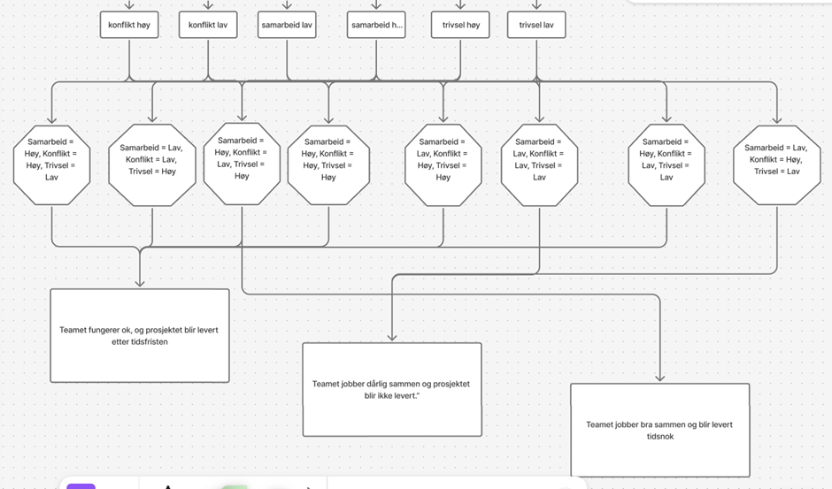

oppstart erling 2
gruppeinlevering 2

1 Situasjonsanalyse av hva som kjennetegner storming-fasen

Det som kjennetegnes i storming-fasen er konflikter som blant annet uklarhet om roller, ulike faglige perspektiver og en nedgang i tillitten. Dette er også kjennetegn som kommer frem i Tuckmans modell (Tevel, Katz & Brock, 2015). Dette kan begrunnes av ulike fagkunnskaper og dårlig kommunikasjon. Medlemmene i teamet forsvarer sine egne påstander fremfor samarbeid. I alle tverrfaglige team vil det oppstå konflikter, ettersom medlemmene i et team har ulike fagkunnskaper. Dette er en faktor som vil kunne føre til at en konflikt kan oppstå, ettersom det kan skape uenigheter i forhold til teamets prioriteringer da medlemmene i teamet kan ha forskjellige fagtradisjoner og metoder. Uenighetene vil da oppstå på grunnlag av hvordan man bør jobbe, hva som regnes som viktig og hvilken løsning som er best. I tillegg vil det være ulike arbeidsfordelinger i et team 
Kommunikasjon er en av de viktigste verktøy for at et team skal kunne fungere gunstig. Enkelte team medlemmer kan være mer direkte og mens andre i teamet kan opptre forsiktig, dette kan føre til at det vil være en friksjon i teamet. Tillegg til dette kan bruk av fagterminologi legge til grunnlag for misforståelser i team. En annen viktig problematikk når det gjelder kommunikasjon, er manglene på informasjonsdeling som vil føre til mer misforståelser og frustrasjon i teamet, samt øke konfliktnivået i et team.  Personligheter og verdiene de ulike medlemmene i teamet har spiller også en rolle på hvordan kommunikasjon blir send mellom mottaker og avsender. Dette vil utspilles i mer konflikter for teamet.  
Dette utfordrer beslutningsprosessen ettersom partene ikke kommer til en felles beslutning. Ettersom medlemmer i et team ofte har ulike mål, tidsperspektiv, risikotoleranse og fagspråk, oppstår det naturligvis konflikter mellom medlemmene i teamet. Sivert prioriterer sikkerhet og kostnadskontroll, mens Silje prioriterer brukervennlighet og åpne prosesser. Som prosjektleder står Erling ovenfor konflikthåndtering, fremdrift, relasjonshåndtering og sikre for felles beslutninger. Han må derfor ta beslutninger uten at relasjoner i teamet krasjer.

2. Definere tre hoved beslutninger Erling må ta.

- Velg tre situasjoner der Erling må velge mellom minst to alternativer.
- Beskriv hvert valg og hvilke mulige konsekvenser det får for teamet (både positive og negative). 
- Hver beslutning skal lede videre til et nytt scenario – slik at storylinen utvikler seg i tre ledd. 
- Bruk pensum og begrunn faglig de beslutningene som tas.

Hovedutfordringer:

1. Hvordan håndtere konflikten mellom Silje og Sivert? 
Eksempler på valg:
 • Skal han ta det opp i plenum for å skape åpenhet? 
 • Skal han ta individuelle samtaler for å dempe temperaturen? • Eller skal han la HR bistå for å sikre en nøytral håndtering?
 • Hvilke andre muligheter har han? 

2. Hvordan forhindre at konflikten mellom Hamdi og Jabir blusser opp? 
Eksempler på valg: 
• Skal han ta initiativ til et felles møte for å avklare uenigheter 
• Eller skal han avvente og håpe at partene finner en løsning selv? 

3. Hvordan bevare motivasjonen i teamet som helhet? 
Eksempler på valg: 
• Skal han sette av tid til relasjonsbygging og sosiale aktiviteter for å gjenopprette tillit? 
• Eller skal han prioritere fremdrift og leveranser for å holde fokus på resultatet? Valgene han tar har ulike konsekvenser for teamets utvikling, tillit og effektivitet.

Konflikt 1

Valg:	Beslutning 1	Konsekvens av 1	Beslutning 2	Konsekvens av 2
Skal han ta det opp i plenum eller individuelt for å skape åpenhet?	Felles samtale	Det fremmer åpenhet og transparens, og dette kan igjen føre til trygghet og tillit i gruppen i storming fasen. I tillegg kan konflikten få flere perspektiver dersom det blir tatt opp i plenum.  Følgende kan bidra til at normer og verdier defineres tidlig og gjør overgangen til norming fasen enklere. Det kan også føre til at partene føler seg utsatt og blir mer tilbakeholdne, og dermed utvikler misnøye og tvil til lederskapet. 	Individuelle samtaler	Individuelle samtaler bidrar til tryggere rammer, og i motsetning til plenum kan man potensielt få en dypere forståelse av de involvertes synsvinkel.
Skal han ta et felles møte med dem der de for jobba sammen 	Felles møte	De får bedre forståelse av hverandres behov, lettere å finne kompromiss mellom kontroll løsning og åpen dialog, forebygger at konflikten vokser, styrker samarbeidet og tydeliggjør rollene.	Vente	Motivasjon kan falle og konflikt kan eskalere. Han overlater konflikten til Silje og Sivert, og satser på at de finner ut av noe selv. 
(Gamst, N. 2024)

2. Hvordan forhindre at konflikten mellom Hamdi og Jabir blusser opp?
Eksempler på valg:
• Skal han ta initiativ til et felles møte for å avklare uenigheter
• Eller skal han avvente og håpe at partene finner en løsning selv?

Konflikt 2
Valg:	Beslutning 1	Konsekvens av 1	Beslutning 2	Konsekvens av 2
Jobbe delvis individuelt	Hamdi og Jabir lager hver sin prototype, før de kombineres disse	Etter fremføring av individuell prototype, var det mange likheter. De valgte gode deler av den andres prototype og puttet det i sluttresultatet. 	Hambi og Jabir lager en felles prototype, etter tidlig diskusjon om enig- og uenigheter.	De brukte lengere tid på prototypen å måtte starte på noe annen siden motivasjon og produktivitet endte opp på det laveste 

 
Avvente og gi ansvaret til partene	Partene møtes og blir enige 	Hamdi og Jabir blir enige om avgjørelsene og konflikten avsluttes. Denne interaksjonen forbedret relasjonen deres og gjør fremtidige konflikter lettere å løse. 	Partene blir ikke enige 	Konflikten blusser opp og blir mer innviklet. Relasjonen mellom Hamdi og Jabir blir svekket, og fremtidige konflikter blir vanskeligere å håndtere.  
(Gamst, N. 2024)
3. Hvordan bevare motivasjonen i teamet som helhet?
Eksempler på valg:
• Skal han sette av tid til relasjonsbygging og sosiale aktiviteter for å
gjenopprette tillit?
• Eller skal han prioritere fremdrift og leveranser for å holde fokus på resultatet?
Valgene han tar har ulike konsekvenser for teamets utvikling, tillit og eYektivitet.

Konflikt 3

Valg:	Beslutning 1	Konsekvens 1	Beslutning 2	Konsekvens 2
Relasjonsbygging	Erling går panter og putter litt ekstra i pantepenger for å kjøpe litt snacks å drikke og er en felles time pause for å mingle midt i jobbdagen 	Kan skape et bra felleskap, med trivsel og motivasjon til å fortsette videre. 	Lavere vekt på sosialt felleskap	Nedprioritering av sosialt felleskap. Kan føre til lite motivasjon og driv videre, altfor fokusert på å bare arbeide. 
Prioritere fremdrift
	Erling ser bort ifra relasjonsbygging og prioriterer fremdrift ovenfor motivasjon innad i gruppen. 
	Dette kan hemme tillit og motivasjon i gruppen, men prosjektet kan potensielt sett bli ferdigstilt raskere. 
	Nedprioritere fremdrift 	Erling nedprioriterer fremdrift og fokuserer på motivasjon, trivsel og miljø i gruppen. Dette kan føre til høyere tillitt, bedre relasjoner og konflikter blir håndtert bedre senere. Konsekvens av dette er at fremdriften i prosjektet reduseres. 

3. Lage en visuell fremstilling av storyline-strukturen.

Tegn et beslutningstre eller flytskjema som viser hvordan situasjonen 
utvikler seg. 
• Bruk korte beskrivelser av hendelser, valg og utfall (for eksempel «Erling tar 
det opp i plenum → åpen konflikt → ny forståelse»). 
• Figuren skal gi et tydelig overblikk over hvordan ulike valg fører til ulike 
resultater.

 
4. Beskrive de tre endepunktene (konklusjonene).

1 “Teamet fungerer ok, og prosjektet blir levert etter tidsfristen.”

Ut ifra valgene du har tatt i programmet, altså svart A eller B. vil programmet huske hva du har svart og utfallet vil variere ut ifra det.2 Får å få dette resultatet har brukeren tatt helt middels valg. Noe som førte til helt middels gjennomføring av prosjektet. Dette resultatet kommer hvis du har svart følgende på spørsmålene i programmet: 

if Samarbeid == "Høy" and konflikt == "Høy" and Trivsel == "Høy":
      print("Teamet fungerer ok, og prosjektet blir levert etter tidsfristen.\n")

elif Samarbeid == "Høy" and konflikt == "Høy" and Trivsel == "Lav":
      print("Teamet fungerer ok, og prosjektet blir levert etter tidsfristen.\n")
elif Samarbeid == "Lav" and konflikt == "Lav" and Trivsel == "Høy":
      print("Teamet fungerer ok, og prosjektet blir levert etter tidsfristen.\n")
elif Samarbeid == "Lav" and konflikt == "Høy" and Trivsel == "Høy":
      print("Teamet fungerer ok, og prosjektet blir levert etter tidsfristen.\n")
elif Samarbeid == "Høy" and konflikt == "Lav" and Trivsel == "Lav":
      print("Teamet fungerer ok, og prosjektet blir levert etter tidsfristen.\n")

2 “Teamet jobber dårlig sammen og prosjektet blir ikke levert.”

Ut ifra valgene du har tatt i programmet, altså svart A eller B. vil programmet huske hva du har svart og utfallet vil variere ut ifra det. Får å få dette resultatet har brukeren tatt dårlige valg. Noe som resulterte i dårlig samarbeid i teamet og de klarte ikke å levere prosjektet. Dette resultatet kommer hvis du har svart følgende på spørsmålene i programmet:

elif Samarbeid == "Lav" and konflikt == "Lav" and Trivsel == "Lav":
      print("Teamet jobber dårlig sammen og prosjektet blir ikke levert.\n")
elif Samarbeid == "Lav" and konflikt == "Høy" and Trivsel == "Lav":
      print("Teamet jobber dårlig sammen og prosjektet blir ikke levert.\n")

3 “Teamet jobber bra sammen og blir levert tidsnok.”

Ut ifra valgene du har tatt i programmet, altså svart A eller B. vil programmet huske hva du har svart og utfallet vil variere ut ifra det. Får å få dette resultatet har brukeren tatt de riktige valgene. Dette førte til at teamet klarte å levere prosjektet som forventet. Dette resultatet kommer hvis du har svart følgende på spørsmålene i programmet:

elif Samarbeid == "Høy" and konflikt == "Lav" and Trivsel == "Høy":
      print("Teamet jobber bra og prosjektet blir levert tidsnok.\n")

Kilde liste
Tevel, E., Katz, H., & Brock, D. M. (2015). Nonprofit financial vulnerability: Testing competing models, recommended improvements, and implications. VOLUNTAS: International Journal of Voluntary and Nonprofit Organizations, 26, 2500-2516. Nonprofit Financial Vulnerability: Testing Competing Models, Recommended Improvements, and Implications
